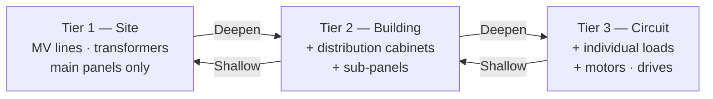
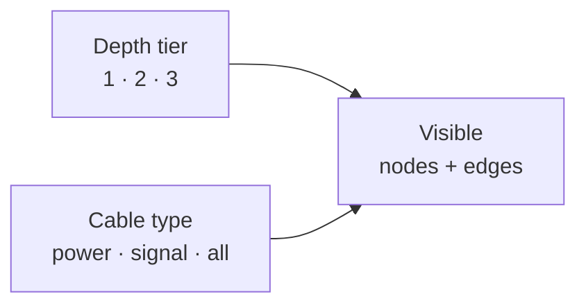

# Scalable Topology Architecture

## Design principles (non-negotiable)

1. **Simplicity first** — this is a troubleshooting tool. Every feature must save time for a technician standing in front of a faulted machine.
2. **No derived state in data** — fault propagation, visibility, and status overrides are computed at render time only; source data stays clean.
3. **Two orthogonal filters** — depth tier and cable type are independent dimensions. A technician can look at "only signal cables at Tier 2" without any special cases.
4. **Extension points over features** — SCADA/OSAPIENS integration and additional cable types are designed in as thin hooks today; full implementation comes later.

---

## The concept: progressive layers on one canvas

The same canvas and spatial layout is always visible. A depth selector controls which equipment layer is rendered — like zooming into a geographic map where more detail appears as you go deeper. Physical building columns and floor bands are preserved at every tier.



At every tier the building column / floor band grid is identical — you always know where you are physically. The building filter still works at any tier.

---

## What the three tiers contain

| Tier | TopologyLayer values visible | Typical equipment |
|---|---|---|
| 1 — Site | `mv-feed` `mv-switchgear` `transformer` `lv-panel` | Incoming feed, MV switch, transformers, main distribution panels |
| 2 — Building | + `cabinet` | Distribution cabinets, motor control centres, sub-panels |
| 3 — Circuit | + `junction` `load` | Individual circuits, motors, drives, junction boxes |

Each node in the data gets `displayTier: 1 | 2 | 3` — the minimum tier at which it becomes visible. Nodes visible at Tier 1 remain visible at Tiers 2 and 3.

---

## Data model change

Two new fields in [`types/topology.ts`](types/topology.ts) for nodes, and an expanded `EdgeType` for cables:

```typescript
// Node additions
export interface TopologyNodeInput {
  displayTier?: 1 | 2 | 3;   // min tier to show — defaults to 1
  circuitCount?: number;       // badge: downstream circuits not yet modelled
}

// Cable type expansion  (currently: 'power' | 'plc' | 'mv')
export type EdgeType =
  | 'mv'        // Medium-voltage power (existing)
  | 'power'     // LV power cable (existing)
  | 'plc'       // PLC / control signal (existing)
  | 'signal'    // Analogue / digital instrument signal
  | 'fieldbus'  // Profibus, PROFINET, EtherCAT, etc.
  | 'ethernet'; // Network / supervisory
```

`externalRefs` on nodes already has `scadaTag` and `osapiensAssetId` — no change needed for SCADA hooks; the integration reads these fields.

---

## Two orthogonal filter dimensions



They are completely independent. A technician checking instrument loops selects "signal cables only" at Tier 2 without touching the depth setting. A maintenance engineer checking power distribution selects Tier 3 with "power only". These are both stored as simple state in `page.tsx`:

```typescript
const [activeTier, setActiveTier] = useState<1 | 2 | 3>(1);
const [visibleEdgeTypes, setVisibleEdgeTypes] = useState<Set<EdgeType>>(
  new Set(['mv', 'power', 'plc', 'signal', 'fieldbus', 'ethernet'])
);
```

---

## Cable-type selector in TopBar

Small toggle group next to the tier selector, showing only the cable types that actually exist in the loaded dataset:

```
Depth:  [ Site ]  [ Building ]  [ Circuit ]    |   Cables:  [⚡ Power]  [~ Signal]  [≡ All]
```

Initially "All" is active. A technician investigating a signal fault can hide all power cables for clarity.

---

## Fault cascade: simple BFS, no stored state

A new small utility [`lib/faultCascade.ts`](lib/faultCascade.ts) runs at render time:

```typescript
/**
 * Given the raw node/edge list, returns a map of nodeId → 'derived-fault' | 'derived-investigation'
 * for any node that is downstream of a faulted or investigating node.
 * Never modifies source data.
 */
export function computeDerivedStatuses(
  nodes: TopologyNode[],
  edges: TopologyEdge[]
): Map<string, 'derived-fault' | 'derived-investigation'>
```

Logic: directed BFS from every node where `status === 'fault'` or `status === 'investigation'`, following edges in the downstream direction (source → target). Any reachable node gets a derived status.

**Why this is correct and simple:**
- No stored state, no watchers, no syncing problem
- Runs in milliseconds even for 500 nodes (BFS on a DAG)
- A technician sees: transformer is red → at Tier 2, the cabinet fed by it is amber → at Tier 3, the motor is amber
- Derived status is a visual overlay only — it does not affect the node's actual stored status

**Visual treatment:**

| Status | Stored | Derived |
|---|---|---|
| `fault` | Solid red glow (existing) | — |
| `investigation` | Amber pulse (existing) | — |
| Derived from upstream fault | — | Dimmer amber outline + small ↑ arrow icon |
| Derived from upstream investigation | — | Very faint amber outline |

The "derived" style is intentionally softer — the technician knows it is propagated, not a confirmed local fault.

---

## Tier selector in TopBar

Three-button toggle added to [`components/layout/TopBar.tsx`](components/layout/TopBar.tsx):

```
[ Site ]  [ Building ]  [ Circuit ]
   T1          T2           T3
```

The active tier is stored as `activeTier: 1 | 2 | 3` in `page.tsx`.

---

## Filtering nodes and edges

In [`lib/topologyFilters.ts`](lib/topologyFilters.ts), extend `filterMapNodes` to accept `activeTier`:

```typescript
// Node visible if its displayTier <= activeTier
node.displayTier ?? 1) <= activeTier
```

Edges are filtered to only include cables where **both** endpoints are currently visible. This prevents dangling wires when a downstream node is hidden.

---

## Layout engine

[`lib/siteLayout.ts`](lib/siteLayout.ts):

- `layoutNodes` positions **all** nodes regardless of tier (so positions are stable when tiers are toggled — no jarring re-layout)
- Increase `NODE_SLOT_SPACING` from `200` → `240` px for tier-1 breathing room
- Extend `BAND_RANK_RANGE` so tier-2/3 rows fit inside the existing floor bands without pushing past band edges
- Tier-3 nodes (loads/motors) sit at the top of their floor band (`LAYER_RANK` 5–6)

---

## Circuit-count badge on DeviceNode

When `activeTier < 3` and a panel/cabinet node has `circuitCount > 0`, show a small pill badge:

```
┌─────────────────────┐
│ ⚡ MDP-01           │
│ Main LV Panel       │
│ ● operational       │
│            [24 ↓]   │  ← badge: 24 downstream circuits hidden
└─────────────────────┘
```

At Tier 3, the badge disappears and the actual circuit nodes appear instead.

---

## Density management across tiers

Because all three tiers share the same physical floor bands:
- Tier 1 is always sparse (~4–8 nodes/building) — no overlap
- Tier 2 adds cabinet rows; the slot algorithm spreads them horizontally within each band
- Tier 3 can be dense, but at that point the user has zoomed in with the building filter active, so they're only looking at one building's worth of nodes

The building filter already handles this: at Tier 3, select a building first, then the load nodes are spread across the full canvas width of that single building.

---

## Implementation order

1. **Revert single-click** — remove double-click logic; restore single `selected` state
2. **Data model** — add `displayTier`, `circuitCount` to `types/topology.ts`; expand `EdgeType`
3. **Assign tiers** — tag all existing nodes with `displayTier: 1`; add sample Tier 2 cabinets and Tier 3 motors to `utility.ts` (one motor marked `fault` to demonstrate cascade)
4. **Filtering** — extend [`lib/topologyFilters.ts`](lib/topologyFilters.ts) for `activeTier` and `visibleEdgeTypes`; hide dangling edges
5. **Layout spacing** — bump `NODE_SLOT_SPACING` to 240; verify Tier 2/3 fit inside floor bands
6. **Fault cascade** — write [`lib/faultCascade.ts`](lib/faultCascade.ts); plug derived statuses into `DeviceNode` rendering
7. **Tier + cable-type selector** — add controls to [`components/layout/TopBar.tsx`](components/layout/TopBar.tsx)
8. **Circuit-count badge** — add badge to [`components/topology/DeviceNode.tsx`](components/topology/DeviceNode.tsx)
